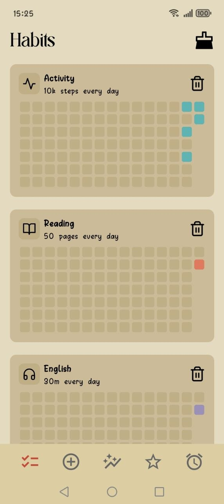
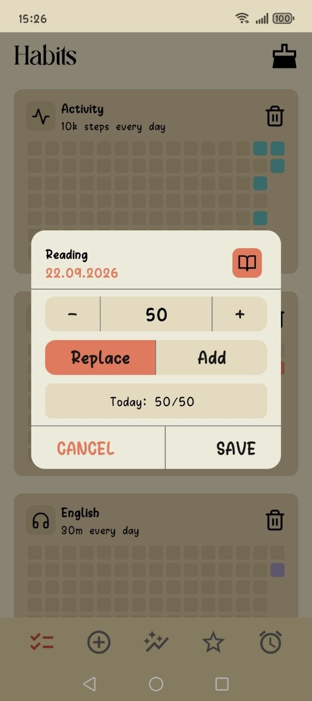
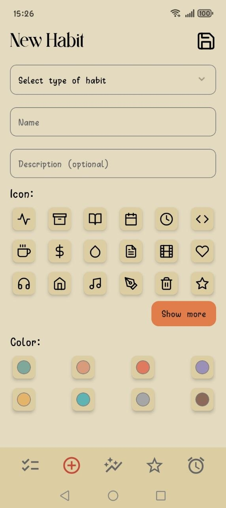
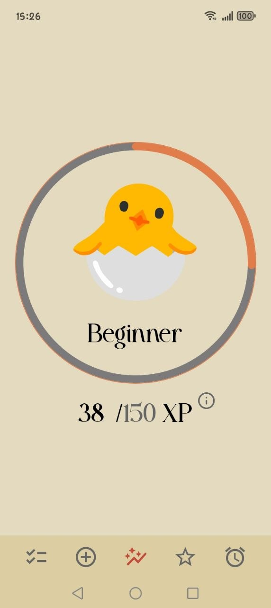
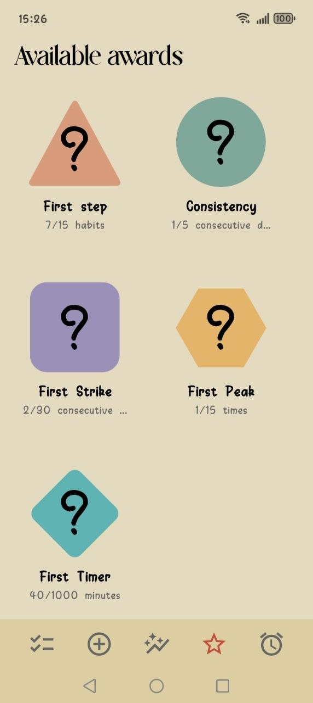
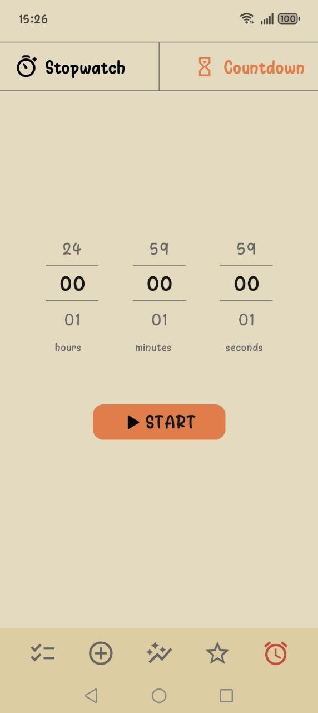

# Habitory

**Habitory** is an interactive habit tracker designed to help users build consistent routines, track their progress, and stay motivated through levels and achievements.

The app supports different types of habits, allowing users to track:

* **Yes/No habits** — simple habits that can be marked as completed or not completed.
* **Time-based habits** — habits that require tracking how long an activity was performed.
* **Quantity-based habits** — habits where users can record a specific amount or value.

Habitory combines habit tracking with **progress levels, streaks, and achievements**, adding a game-like element to everyday routines and making it easier to stay motivated.

---

## 📋 Habits

The **Habits** screen contains all active habits in one place.

Each habit is displayed as a contribution-style activity board, similar to the visual concept used by GitHub. Completed days are highlighted, making it easy to see activity patterns and maintain a consistent streak.

By tapping a habit, users can record their progress depending on its type:

* mark a Yes/No habit as completed;
* enter a value for a quantity-based habit;
* save a completed time-based activity.

The activity board provides a quick visual overview of consistency and helps users avoid breaking their streak.

---

## ➕ Create a Habit

The **Create Habit** screen allows users to create habits that match their personal goals and routines.

Users can choose the habit type and customize it by adding:

* a habit name;
* a short description;
* an icon;
* a custom color;
* a target value or duration, depending on the habit type.

This makes it possible to create both simple daily habits and more specific goals that require tracking time or quantity.

---

## 📈 Progress

The **Progress** screen turns everyday habit completion into a long-term progression system.

There are **10 levels**, starting with **Beginner** and progressing all the way to **Legend**.

As users consistently complete their habits, their progress increases and they move through the levels. This system provides an additional source of motivation and gives users a clear sense of growth over time.

Instead of focusing only on individual completed habits, the Progress screen shows the bigger picture — how daily actions gradually build towards a larger achievement.

---

## 🏆 Awards

The **Awards** system adds a game-like element to habit tracking.

Users can earn achievements by completing habits and maintaining consistent activity. There are **five award categories**, covering different types of accomplishments, including achievements for individual habit activity and maintaining streaks.

Awards provide additional goals to work towards and make the process of building habits more engaging and rewarding.

---

## ⏱️ Timer

The **Timer** screen is designed for habits where the amount of time spent on an activity matters.

Users can start a timer, perform their activity, and track the duration directly in the app. Once the activity is completed, the recorded result can be saved to the corresponding time-based habit.

This makes Habitory suitable for activities such as:

* meditation;
* reading;
* exercising;
* studying;
* stretching;
* or any other activity measured by time.

---

## 🎯 Why Habitory?

Habitory combines **simple daily tracking with visual progress and gamification**.

The combination of activity boards, streaks, levels, and awards helps transform habit tracking from a simple checklist into an interactive experience where users can see their consistency, track their growth, and stay motivated to keep going.
